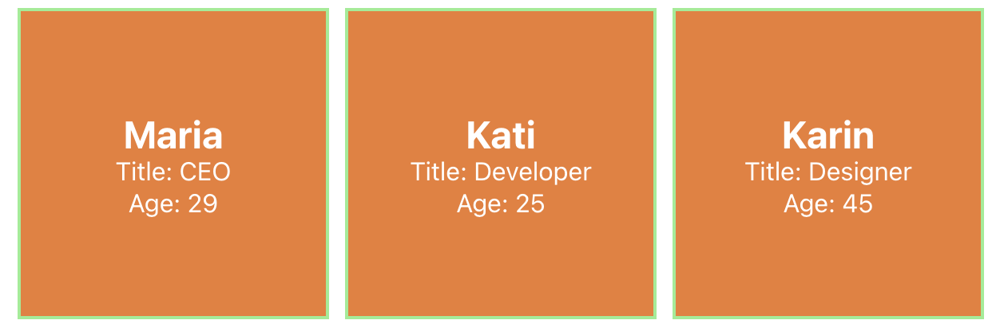

# 01-react-ja-redux

Tee oheisesta linkistä löytyvän kuvan mukainen komponentti niin vähällä määrällä koodia kuin pystyt.

<figure style="display: block">
    
</figure>
<a href="./01-react-ja-redux-assignment.png">Oppimistehtävän tavoite</a>